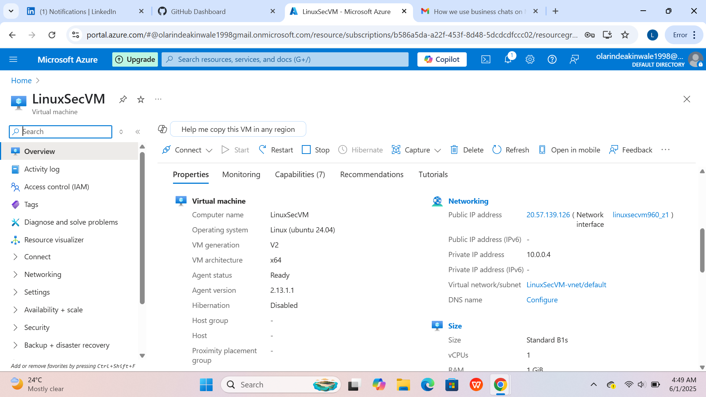
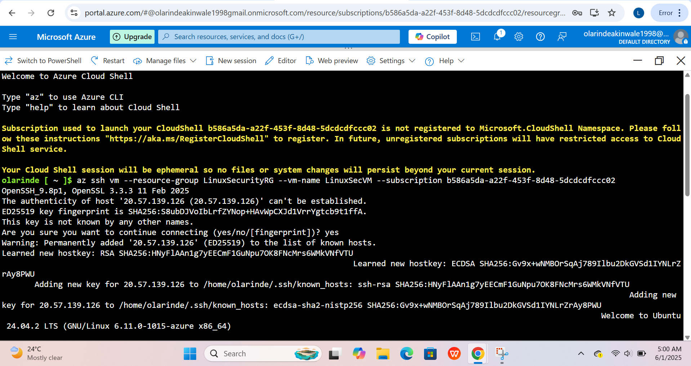
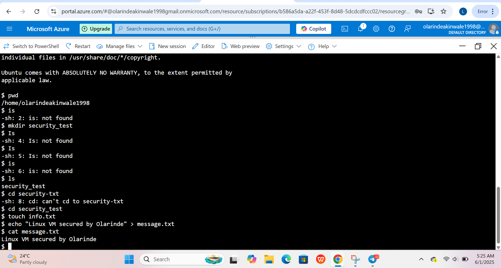
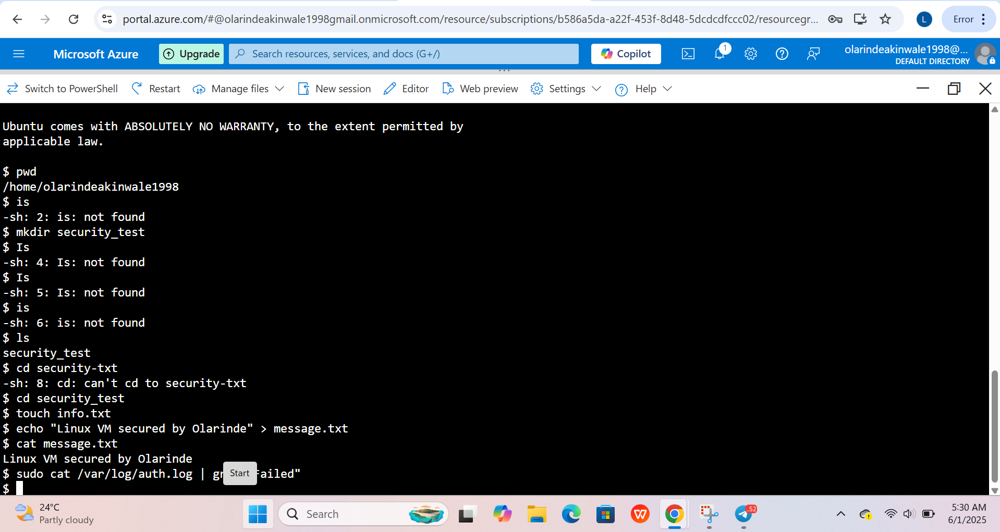
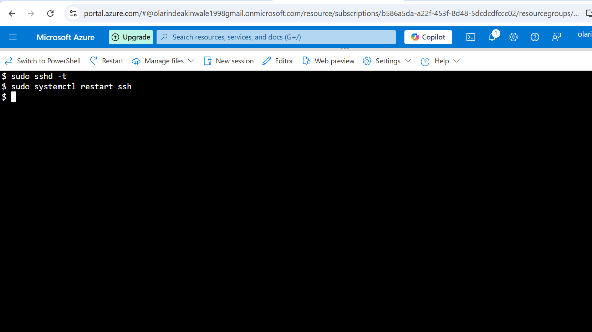
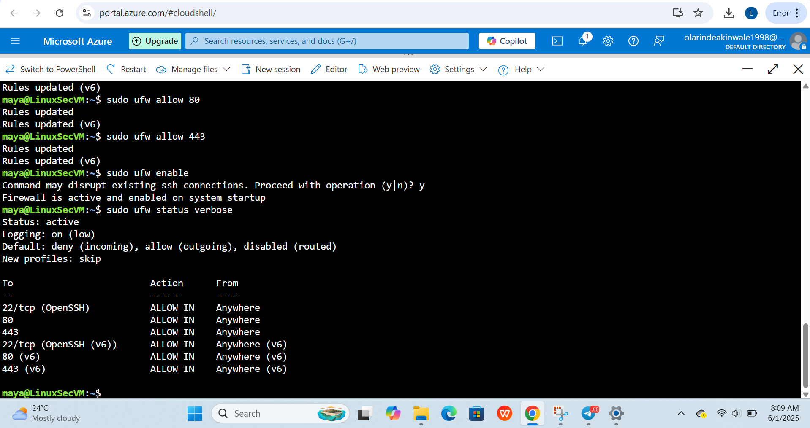

# 🔐 Secure Ubuntu VM with SSH Hardening and UFW Firewall on Azure

This project demonstrates how to securely deploy and harden an Ubuntu virtual machine (VM) on Microsoft Azure using SSH key authentication, UFW firewall configuration, and basic Linux security hygiene.

---

## ✅ Real-Life Scenario

Client: *Kik Perfume – An online perfume store*

Scenario:  
Kik Perfume wants to host its product catalog and internal management system on a secure cloud server. As their cloud security engineer, your task is to:

- Deploy a secure Ubuntu VM.
- Harden SSH access (disable root login and enforce key-based login).
- Set up firewall rules to only allow essential traffic (SSH, HTTP, HTTPS).
- Validate that no unauthorized users or services are active.

---

## ⚙️ Technologies Used

- Microsoft Azure
- Ubuntu 22.04 LTS
- SSH Key Pair (RSA)
- UFW (Uncomplicated Firewall)
- Azure CLI
- GitHub (for documentation)

---

## 🧰 Step-by-Step Implementation

### 1. ✅ Deploy Ubuntu VM via Azure Portal  

